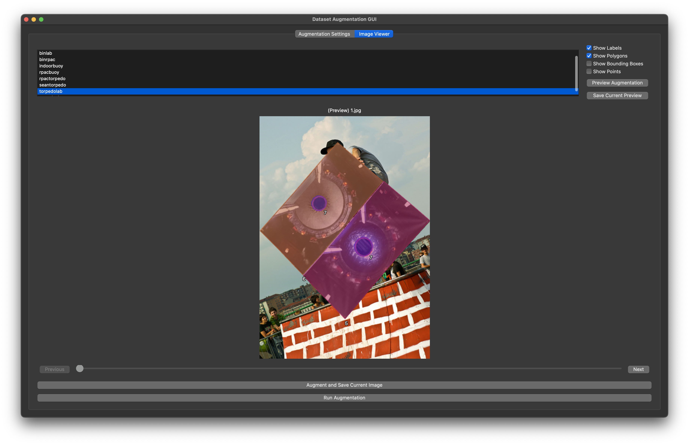

# Dataset Augmentation Tool

This tool provides a graphical interface for augmenting image datasets with various techniques such as mirroring, cropping, zooming, rotating, and overlaying additional images. Users can preview the augmentations and apply them to individual images or the entire dataset.



## Features

- **Directory Selection**: Choose the dataset root and overlay image directory.
- **Augmentation Configuration**: Adjust parameters like mirror weights, crop weights, zoom weights, rotate weights, and overlay weights.
- **Skip Augmentations**: Option to skip certain augmentations for specific folders.
- **Image Viewer**: View and navigate through images in the dataset.
- **Single Image Augmentation**: Augment the currently displayed image.
- **Batch Augmentation**: Apply augmentations to the entire dataset.
- **Real-time Augmentation Preview**: Preview augmentations in real-time before applying them.
- **Annotation Overlay**: Display and augment annotations such as bounding boxes and polygons.

### Coming soon

- **Undo/Redo Functionality**: Undo or redo augmentations.

- **Customizable Augmentation Pipelines**: Create and save custom augmentation pipelines for reuse.
- **Output Directory Management**: Specify output directories for augmented datasets.
- **Comprehensive Logging**: Keep detailed logs of augmentations applied for reproducibility.

## Dataset Structure

The dataset should be structured as follows:
```
Dataset/
│
├── images/
│   ├── train/
│   │   └── foldername/
│   │       └── 1.png
│   ├── val/
│   │   └── foldername/
│   │       └── 2.png
│
├── labels/
    ├── train/
    │   └── foldername/
    │       └── 1.txt
    ├── val/
        └── foldername/
            └── 2.txt
```

The labels should be in YOLO format, supporting polygons or boxes. Examples:

- **Polygons**:
    ```
    class_id x1 y1 x2 y2 x3 y3 x4 y4 ...
    ```
- **Boxes**:
    ```
    class_id xcenter ycenter width height
    ```

## Setting Up the Environment

1. **Create a Virtual Environment**:
    ```bash
    python -m venv venv
    ```

2. **Activate the Virtual Environment**:
    - On Windows:
        ```bash
        venv\Scripts\activate
        ```
    - On macOS and Linux:
        ```bash
        source venv/bin/activate
        ```

3. **Install the Required Dependencies**:
    ```bash
    pip install -r requirements.txt
    ```

## Usage

1. **Initialize and Run**:
    ```bash
    python augmentationApp.py
    ```

2. **Select Directories**: Use the buttons to select the dataset root directory and overlay image directory.
3. **Configure Augmentations**: Adjust the augmentation parameters using the sliders and checkboxes.
4. **Preview and Navigate**: Use the image viewer to navigate through the dataset and preview the augmentations.
5. **Single Image Augmentation**: Click "Augment Current Image" to apply augmentations to the currently displayed image.
6. **Batch Augmentation**: Click "Run Augmentation" to apply the configured augmentations to the entire dataset.

## Customization and Configuration

- **Custom Augmentation Pipelines**: Users can create custom pipelines by combining different augmentation techniques and save them for future use.
- **Output Management**: Augmented datasets can be saved in specified output directories, allowing users to maintain original datasets separately.
- **Logging and Reproducibility**: The tool provides detailed logs of augmentations applied to each image, ensuring reproducibility of results.